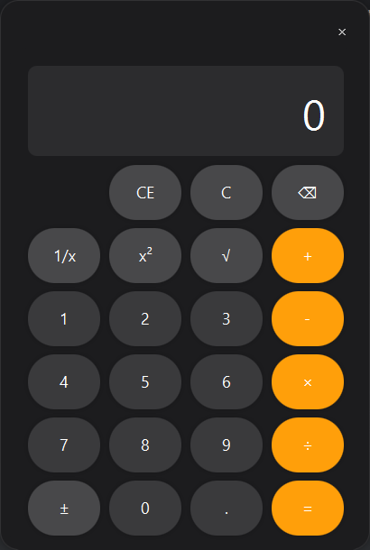

# Modern JavaFX Calculator
A modern calculator application built with JavaFX, featuring a macOS-inspired design. This project demonstrates the implementation of the Model-View-Controller (MVC) pattern and modern JavaFX UI development practices.

##  Features

- Clean, modern user interface with a dark theme
- Basic arithmetic operations (addition, subtraction, multiplication, division)
- Advanced mathematical functions:
  - Square root (√)
  - Square (x²)
  - Reciprocal (1/x)
  - Sign toggle (±)


- Additional functionality:
    - Clear (C)
    - Clear Entry (CE)
    - Backspace (⌫)
    - Decimal point support

- Keyboard support for all operations 
- Customizable display formatting 
- Comprehensive error handling 
- Detailed logging system

## Technical Details
### Architecture
The application follows the MVC (Model-View-Controller) architectural pattern:

- **Model** (`CalculatorModel`): Handles the calculator's business logic and state
- **View** (`CalculatorView`): Manages the UI components and layout
- **Controller** (`CalculatorController`): Coordinates between the Model and View

### Key Components

- **Operation Enum**: Defines the supported mathematical operations 
- **Logging**: Utilizes Log4j2 for comprehensive application logging 
- **Event Handling**: Supports both mouse and keyboard input 
- **Number Formatting**: Uses DecimalFormat for consistent number display

### UI Features

- Borderless window with custom title bar 
- Draggable window support 
- Smooth button hover effects 
- High-contrast color scheme
- Modern SF Pro Display font

## Getting Started

### Prerequisites

- Java 17 or higher
- JavaFX 17 or higher
- Apache Log4j2
- Maven (for dependency management)

### Building the Project

1. Clone the repository:

```bash
git clone [repository-url]
```

2. Navigate to the project directory:

```bash
cd javafx-calculator
```

3. Build with Maven:

```bash
mvn clean install
```

### Running the Application
Execute the main class `org.openjfx.App`:
```bash
mvn javafx:run
```

## Keyboard Shortcuts

- **Numbers**: 0-9
- **Operations**:
  - Addition: + or Shift+=
  - Subtraction: -
  - Multiplication: * or Shift+8
  - Division: /
- **Functions**:

    - Square: Q
    - Reciprocal: R
    - Square Root: Shift+2
- **Control**:
   - Enter/Equals: Enter or =
   - Clear: Esc
   - Clear Entry: Delete
   - Backspace: Backspace
   - Decimal Point: .


## Acknowledgements
- Inspired by the macOS calculator design
- Built with JavaFX and modern Java practices
